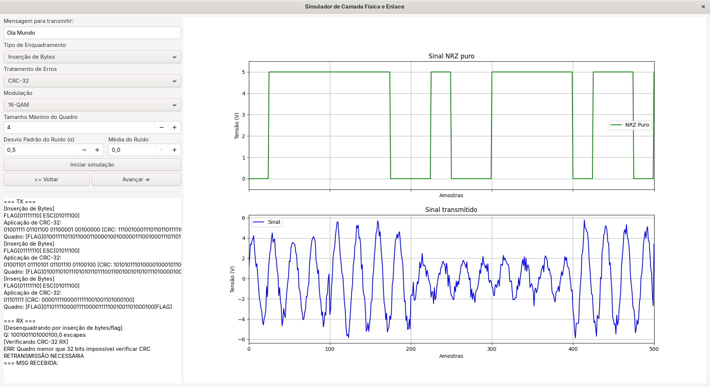

## TRABALHO DE TELEINFORMÁTICA E REDES 1

Simulador de camada física e camada de enlace em Python

---

Este programa consiste em um simulador de camada física e enlace em redes, 
e foi desenvolvido para disciplina de teleinformática e redes 1 da UnB. 
Consite em uma janela que simula a comunicação entre Tx e Rx, de uma mensagem
em caracteres ASCII, que pode ser enquadrada de diferentes formas:
contagem de bytes, inserção de bytes, inserção de bits; e pode receber códigos 
de tratamento de erro como bit de paridade, hamming, crc-32 e checksum. 
Além disso, o simulador também implementa codificação por banda base 
e modulações por portadora.

--- 

### Requisitos

- python
- python3-gi 
- python3-gi-cairo 
- gir1.2-gtk-3.0

### Como executar
```sh
# criar um ambiente virtual
python -m venv venv

# ativar ambiente (Linux, ou comando análogo no Windows)
source venv/bin/activate

# instalar as dependências necessárias no ambiente virtual
pip install -r requirements.txt

# instanciar a janela
python simulador/Simulador.py
```
--- 

